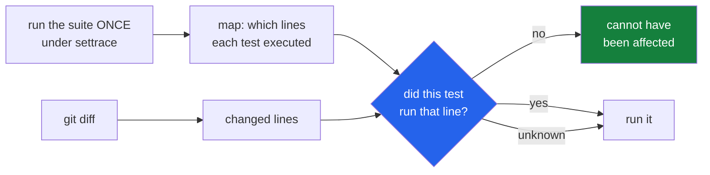

<h1 align="center">test-impact-oracle (Python · pytest · settrace · mutation testing · zero deps)</h1>
<p align="center"><i>Run only the tests a change could possibly affect — and measure what that skips, not just what it saves</i></p>

<p align="center">
  <a href="#the-through-line">The through-line</a> &middot;
  <a href="#the-result">The result</a> &middot;
  <a href="docs/RESULTS.md">Full results</a> &middot;
  <a href="#how-it-works">How it works</a> &middot;
  <a href="#run-it">Run it</a> &middot;
  <a href="#what-this-does-not-do">What it does NOT do</a> &middot;
  <a href="#problems-hit-while-building-this">Problems hit</a>
</p>

<p align="center">
  <a href="https://github.com/hammasbuilds/test-impact-oracle/actions/workflows/ci.yml"></a>
  
  
  
  
  <a href="LICENSE"></a>
</p>

---

## The through-line



The rule is one sentence: **a test that never executed the line you changed cannot have been
affected by changing it.** Everything else in this repository is the list of cases where that
sentence does not apply, and each of them resolves the same way — run the test.

Every test-selection tool can tell you how much time it saved. That number alone is
worthless, because returning an empty selection saves the most time of all. The question that
decides whether the tool is safe to adopt is the other one: **of the changes that broke
something, how many had every broken test selected?**

So this measures both, on changes whose consequences are known.

## The result

Seven repositories, 287 tests. For each mutation: apply it, run the **whole** suite to find
out what it really broke, then check the selection contained every one of those tests.

```
     41  mutants broke nothing - the suite cannot tell the versions apart
     43  mutants broke at least one test
     43  of those had EVERY broken test selected  (100% safe)

        mean reduction: 90.1% of the suite skipped
        wall clock: 92s of selected runs against 241s of full runs (62% saved)
```

| repo | tests | mutants | broke something | safe | reduction |
|---|---:|---:|---:|---:|---:|
| repo-surgeon | 47 | 12 | 4 | 100% | 94% |
| pr-referee | 37 | 12 | 8 | 100% | 91% |
| trace-to-patch | 30 | 12 | 6 | 100% | 92% |
| suite-auditor | 24 | 12 | 4 | 100% | 94% |
| blast-radius | 28 | 12 | 6 | 100% | 87% |
| flake-detective | 55 | 12 | 8 | 100% | 87% |
| cartographer | 66 | 12 | 7 | 100% | 89% |

**Safety is all-or-nothing per change, not an average of recalls.** A change where nine of
ten broken tests were selected is a change whose regression reached production. Averaging
would report that as 90% and make it sound like a near miss.

### 100% is the expected answer, and that is the problem with it

For a single-line change under line-level tracing, perfect safety is what the method
*should* give. A clean number like that usually means the interesting cases were not
exercised — so the limits are built as failing cases and checked by
[`tests/test_blind_spots.py`](tests/test_blind_spots.py) rather than hedged about in prose:

```python
assert sub_test not in s.selected, (
    "if this ever passes, the tracer learned to follow subprocesses and the "
    "README's stated limit is out of date"
)
```

That test passes today. **The selector really does skip a test that the change really does
break** — when the changed line is reached only from a subprocess, in a file that some other
test imports in-process. See [what this does not do](#what-this-does-not-do).

## How it works

**The map is built by running, not by reading.** One traced run of the suite records, per
test, every `(file, line)` it executed. A registry lookup, a plugin hook, a string-keyed
dispatch table — none of it has to be understood, because the line either ran or it did not.

**About sixty lines of `sys.settrace`, not `coverage.py`.** That keeps the runtime dependency
count at zero and, more usefully, keeps the semantics legible: a line is recorded when a
Python frame executes it, and nothing else is recorded at all.

**The whole protocol is traced, not just the call.** Fixtures do their work in setup, and a
change inside a fixture has to select every test that uses it.

**Every uncertainty is spent on running more.** A file the map has never seen selects
everything. A test the map has never seen is always selected. A changed *test* file selects
every test in it. A changed line in a covered file that no test executed still selects every
test that touched that file — because module-level code runs once, during the first import,
and is credited to whichever test happened to trigger it.

**The ground truth is made, not assumed.** Nobody knows what a real commit breaks without
running the suite, so the benchmark mutates one line — a comparison flipped, a boundary
moved — and runs everything to find out. Operators are chosen to be plausible mistakes: a
change that breaks an import breaks every test and would let any selector score perfectly.

## Run it

```bash
git clone https://github.com/hammasbuilds/test-impact-oracle
cd test-impact-oracle
uv venv && uv pip install -e ".[dev]"

tio map /path/to/repo --python /path/to/repo/.venv/bin/python   # once, slow
tio select /path/to/repo --since origin/main --why              # what to run, and why
tio select /path/to/repo --since origin/main --run              # and run it

tio bench /path/to/repo /path/to/other --mutants 12             # is it actually safe?
```

Needs no model, no API key, no GPU, no runtime dependencies. The benchmark works on a
**copy**, with the copy's `src` ahead of any editable install, so the repositories being
measured are never modified.

## Layout

```
src/test_impact_oracle/
  trace.py     the generated pytest plugin, and what settrace cannot see
  mapping.py   build the map, and refuse to call an empty one a success
  select.py    the rule, and every case where it stops applying
  mutate.py    single-line changes that splice back in, comments intact
  suite.py     run a suite or a subset; an empty selection runs nothing
  bench.py     safety against reduction, with an honest denominator
```

## What this does NOT do

- **It cannot see into a subprocess.** `settrace` fires for frames in this interpreter. The
  dangerous shape is a file imported in-process by one test and executed as a script by
  another: the file *is* in the map, so the unknown-file fallback never fires, and a change
  to a line only the subprocess reaches is attributed to nobody. Demonstrated in
  `tests/test_blind_spots.py`.
- **It cannot see into C.** Behaviour reached only through a compiled extension records
  nothing.
- **A stale map is silently wrong.** Insert a line at the top of a file and every line below
  it shifts; a diff naming line 12 no longer means what the map's line 12 meant. Nothing here
  detects that. Rebuild the map when the tree moves.
- **`pytest-xdist` is refused, not tolerated.** Tracing under `-n` would install the tracer
  per worker and interleave the attribution. The plugin raises rather than writing a map that
  looks right.
- **Building the map costs a full traced run**, which is several times slower than the suite.
  It pays for itself over many selections and not over one.
- **Test *order* effects are out of scope.** Running a subset changes what ran before what.
  A suite with order-dependent tests can fail differently under selection — that is a real
  property of the suite, and [flake-detective](https://github.com/hammasbuilds/flake-detective)
  is the tool for finding it.
- **The corpus is seven of my own repositories.** They share an author and a style, they are
  all libraries, and none is large. 90% reduction on a 300-test suite is not evidence about a
  30,000-test monorepo.

## Problems hit while building this

- **The map was 90% pytest tracing itself.** `.venv` lives *inside* the repository, so "is
  this file under the root?" happily admitted `site-packages`. blast-radius traced to 51
  files and 1021 lines per test; with virtualenv directories excluded it is 4 files and 17.
  (`build` and `dist` are deliberately *not* excluded — a project can ship its package at
  `src/build/`, and skipping directories by name is how you report that a repo has no source.)
- **An empty map reported success.** Tracing a src-layout project without putting its `src`
  on the path traces whatever is installed instead; the imported files then sit outside the
  traced root, get discarded, and the map comes back holding only the test files — while
  still saying `traced_ok`. A map with no tests in it is now an error.
- **The only unsafe result in the corpus was a regex.** `-rf` prints
  `FAILED path::test[id] - AssertionError: ...` and the parser matched `\S+`, which stops at
  the first space — so `test_counting[(x, y)-2]` was captured as `test_counting[(x,`. A
  truncated id matches nothing in the selection, so the benchmark reported a missed test and
  blamed the selector. Safety went from 97.7% to 100% by fixing the parser, and the same bug
  was fixed in flake-detective, which shares the idiom.
- **Mutating with `ast.unparse` rewrites the whole file.** It drops every comment and
  reformats everything, so a one-line change arrives as a diff touching every line — and
  several repositories in the corpus read their own source, which would fail their tests for
  reasons the mutation had nothing to do with. Only the mutated statement's own lines are
  rewritten now, re-indented and spliced back.

## Also worth reading

| | |
|---|---|
| &#128202; **[Results](docs/RESULTS.md)** | All seven repositories, with the blind spots |
| **[suite-auditor](https://github.com/hammasbuilds/suite-auditor)** | What a passing suite does not check |
| **[flake-detective](https://github.com/hammasbuilds/flake-detective)** | Which variable a flaky test depends on |
| **[cartographer](https://github.com/hammasbuilds/cartographer)** | What a repo's imports claim, against what its history shows |
| **[pr-referee](https://github.com/hammasbuilds/pr-referee)** | Whether a diff changes behaviour, by running both sides |

## Keywords

test impact analysis &middot; test selection &middot; regression test selection &middot;
pytest &middot; sys.settrace &middot; coverage &middot; mutation testing &middot; CI
&middot; build times &middot; monorepo &middot; change-based testing

## License

MIT - see [LICENSE](LICENSE).
